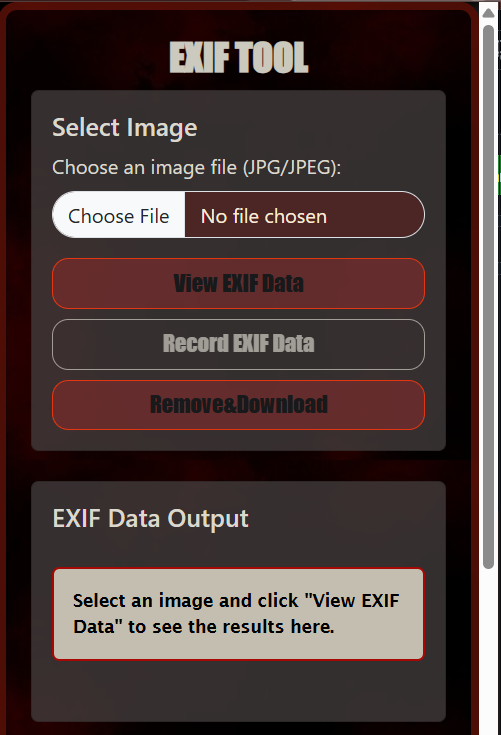

<div align="center">

  

  # EXIF TOOL Extension
  
  [](https://opensource.org/licenses/MIT)
  [](https://www.google.com/chrome/)
  [](https://github.com/HRTvictor/EXIF_TOOL_extension/stargazers)

  **Instantly extract and view hidden metadata from any web image.**
  
  [Report Bug](https://github.com/HRTvictor/EXIF_TOOL_extension/issues) · [Request Feature](https://github.com/HRTvictor/EXIF_TOOL_extension/issues)

</div>

---

## 📖 Overview

**EXIF TOOL** is a lightweight Chrome extension designed for photographers, developers, and privacy-conscious users. It allows you to peek behind the curtain of any image on the web to see the **EXIF (Exchangeable Image File Format)** data, including camera settings, GPS locations, and timestamps.

### 🌟 Key Features

| Feature | Description |
| :--- | :--- |
| **One-Click Analysis** | Right-click any image to instantly pull technical metadata. |
| **GPS Mapping** | Automatic detection of GPS coordinates with links to Google Maps. |
| **Camera Specs** | View ISO, Aperture, Shutter Speed, and Focal Length details. |
| **Privacy First** | All processing happens locally in your browser. No data leaves your machine. |
| **Lightweight** | Zero background resource consumption when not in use. |

---

## 📸 Preview

<div align="center">
  
  <p><i>Visual interface of the EXIF TOOL metadata extractor.</i></p>
</div>

---

## 🚀 Installation

### Developer Mode (Manual)
1.  **Clone the Repo**
    ```bash
    git clone [https://github.com/HRTvictor/EXIF_TOOL_extension.git](https://github.com/HRTvictor/EXIF_TOOL_extension.git)
    ```
2.  **Open Chrome Extensions**
    Navigate to `chrome://extensions/` in your browser.
3.  **Enable Developer Mode**
    Toggle the switch in the top-right corner.
4.  **Load Unpacked**
    Click the **"Load unpacked"** button and select the project folder.

---

## 🛠 Tech Stack

* **Logic:** JavaScript (ES6)
* **Styling:** CSS3 (Modern Flexbox/Grid)
* **API:** Chrome Extension API (Manifest V3)
* **Parsing:** [Exif.js](https://github.com/exif-js/exif-js)

---

## 🤝 Contributing

1. Fork the Project
2. Create your Feature Branch (`git checkout -b feature/AmazingFeature`)
3. Commit your Changes (`git commit -m 'Add some AmazingFeature'`)
4. Push to the Branch (`git push origin feature/AmazingFeature`)
5. Open a Pull Request

---

## 📄 License

Distributed under the **MIT License**. See `LICENSE` for more information.

---

<div align="center">
  <p>Developed with ❤️ by <a href="https://github.com/HRTvictor">Harshit Raj</a></p>
</div>
